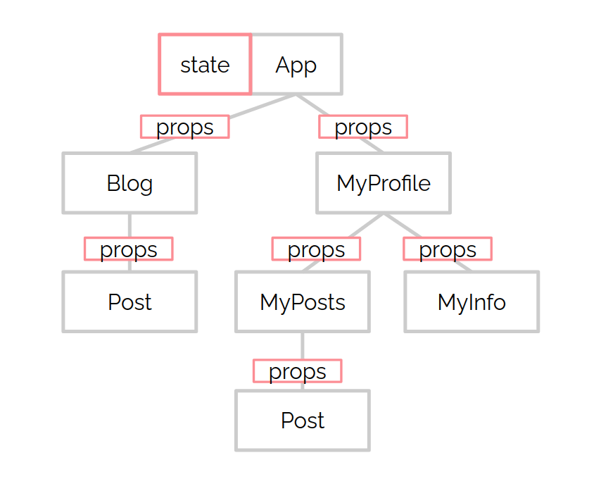
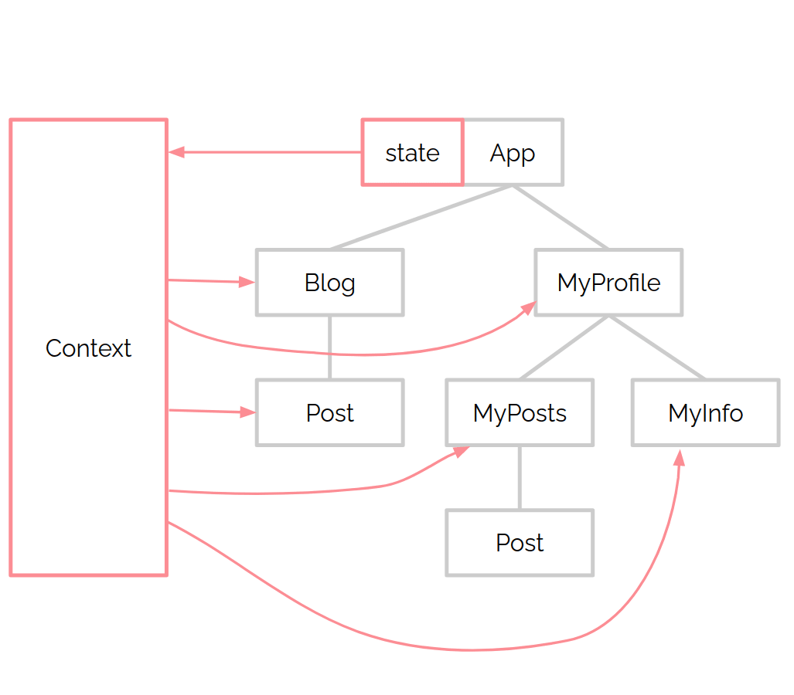

## Introduction

Dans cette ressource, nous allons introduire le concept de Context API dans React. Comme il est indiqué dans la [documentation officielle](https://react.dev/learn/passing-data-deeply-with-context) :

> Habituellement, vous transmettrez des informations d'un composant parent à un composant enfant via des props. Mais transmettre des props peut devenir verbeux et peu pratique si vous devez les transmettre via de nombreux composants entre des grand-parents et leurs petits enfants, ou si de nombreux composants de votre application ont besoin des mêmes informations. Le contexte permet au composant parent de rendre certaines informations disponibles à n'importe quel composant de l'arborescence située en dessous, quelle que soit sa profondeur, sans les transmettre explicitement via les props.

**C'est parti!**


## Objectifs

- ✅ comprendre quand utiliser un contexte
- ✅ créer un contexte
- ✅ lire les informations d'un contexte

## Pourquoi utiliser un contexte ?

Un concept courant dans React est connu sous le nom de **prop-drilling** : transmettre les props à travers plusieurs niveaux dans la hiérarchie des composants. Certains composants peuvent même ne pas utiliser le prop reçu : ils la transmettent simplement à un enfant dans l'arborescence des composants. Regardons le schéma suivant :



En utilisant un contexte, tu peux stocker un state dans un espace "global". Ce state va être accessible depuis n'importe quel composant connaissant ton contexte, comme indiqué sur le diagramme suivant :



## Comment utiliser l'API de contexte ?

Créons une application React qui affichera une liste de films. Nous allons diviser cela en 2 parties : créer un contexte et consommer ses données.

### Créer un contexte

Voyons d'abord comment créer un contexte. Ce contexte permettra de mettre à disposition des valeurs globales :

```jsx
// contexts/MovieContext.js
import { createContext } from "react";

const MovieContext = createContext(null);

export default MovieContext;
```

### Fournir un contexte

Ensuite, nous récupérons un utilisons le contexte comme un `Provider`, qui recevra la valeur que nous voulons partager. Le contexte sera disponible pour tous les composants contenus dans le `Provider` (enfants, petits-enfants...) :

```jsx
// App.js
import { useState } from "react";

import MovieList from './components/MovieList';
import MovieContext from './contexts/MovieContext';

function App() {
  const [movies, setMovies] = useState([
    {
      movie_id: 1,
      title: 'Harry Potter and the Sorcerers Stone',
      release_year: 2001,
    },
    {
      movie_id: 2,
      title: 'Harry Potter and the Chamber of Secrets',
      release_year: 2002,
    },
    {
      movie_id: 3,
      title: 'Harry Potter and the Prison of Azkaban',
      release_year: 2004,
    },
  ]);

  return (
    <MovieContext value={{ movies: movies }}>
      <MovieList />
    </MovieContext>
  );
}

export default App;
```

### Consommer un contexte

Maintenant, sur le composant où nous souhaitons récupérer le tableau `movies`, importons le hook `useContext` pour prévenir que nous allons utiliser un contexte (à donner en paramètre) :

```jsx
// components/MovieList.js
import { useContext } from 'react';
import MovieContext from '../contexts/MovieContext';

function MovieList() {
  const { movies } = useContext(MovieContext);

  return (
    <section>
      <h1>Movie List</h1>
    </section>
  );
}

export default MovieList;
```

Voici une démo complète avec l'affichage des films :


import { useState } from "react";

import MovieList from "./components/MovieList";
import MovieContext from "./contexts/MovieContext";

function App() {
  const [movies, setMovies] = useState([
    {
      movie_id: 1,
      title: "Harry Potter and the Sorcerers Stone",
      release_year: 2001,
    },
    {
      movie_id: 2,
      title: "Harry Potter and the Chamber of Secrets",
      release_year: 2002,
    },
    {
      movie_id: 3,
      title: "Harry Potter and the Prison of Azkaban",
      release_year: 2004,
    },
  ]);

  return (
    <MovieContext value={{ movies: movies }}>
      <MovieList />
    </MovieContext>
  );
}

export default App;



import { useContext } from "react";

import MovieContext from "../contexts/MovieContext";

function MovieList() {
  const { movies } = useContext(MovieContext);

  return (
    <section>
      <h1>Movie List</h1>
      <ul>
        {movies.map((movie) => (
          <li key={movie.movie_id}>
            {movie.title} ({movie.release_year})
          </li>
        ))}
      </ul>
    </section>
  );
}

export default MovieList;



import { createContext } from "react";

const MovieContext = createContext(null);

export default MovieContext;




## Changer l'état dans le contexte

Tu viens de voir comment envoyer un state dans un contexte. Mais le contenu d'un state est sensé varier en fonction des interactions de l'utilisateur.

Tout comme tu as envoyé la valeur de `movies` par le `Provider`, il est possible d'envoyer la fonction `setMovies` :

```jsx
return (
  <MovieContext value={{ movies: movies, setMovies: setMovies }}>
    <MoviesList />
  </MovieContext>
);
```

Maintenant, tu peux récupérer cette méthode dans le composant `MoviesList` en utilisant la déstructuration :

```jsx
const { movies, setMovies } = useContext(MovieContext);
```

Dans un exemple en live :


import { useState } from "react";

import MovieList from "./components/MovieList";
import MovieContext from "./contexts/MovieContext";

function App() {
  const [movies, setMovies] = useState([
    {
      movie_id: 1,
      title: 'Harry Potter and the Sorcerers Stone',
      release_year: 2001,
    },
    {
      movie_id: 2,
      title: 'Harry Potter and the Chamber of Secrets',
      release_year: 2002,
    },
    {
      movie_id: 3,
      title: 'Harry Potter and the Prison of Azkaban',
      release_year: 2004,
    },
  ]);

  return (
    <MovieContext value={{ movies: movies, setMovies: setMovies }}>
      <MovieList />
    </MovieContext>
  );
}

export default App;



import { useContext } from "react";

import MovieContext from "../contexts/MovieContext";

function MovieList() {
  const { movies, setMovies } = useContext(MovieContext);

  return (
    <section>
      <h1>Movie List</h1>
      <ul>
        {movies.map((movie) => (
          <li key={movie.movie_id}>
            {movie.title} ({movie.release_year})
          </li>
        ))}
      </ul>
      {movies.length < 4 && (
        <button
          onClick={() => {
            setMovies([
              ...movies,
              {
                movie_id: 4,
                title: 'Harry Potter and the Goblet of Fire',
                release_year: 2005,
              },
            ]);
          }}
        >
          More
        </button>
      )}
    </section>
  );
}

export default MovieList;



import { createContext } from "react";

const MovieContext = createContext(null);

export default MovieContext;




## Challenge

Dans ce défi, tu vas réaliser une application simple qui changera le statut de l'utilisateur en un clic !

* fork le code suivant ;
* Dans `UserContext.js`, créez un contexte `UserContext` ;
* Crée un state `isOnline` dans `App.js` (par défaut défini sur false) avec `useState` ;
* Importe le contexte dans `App.js` et utilise le comme un `Provider` ;
* Passe un objet avec `isOnline` et `setIsOnline` comme valeur pour le `Provider` ;
* Dans `UserProfile.js`, consomme les données du contexte avec `useContext` ;
* Modifie le texte pour qu'il affiche "en ligne" si la valeur booléenne est "true", et "hors ligne" si la valeur est "false" ;
* Ajoute un écouteur d'événement sur le bouton qui appellera `setIsOnline` et basculera la valeur de `isOnline`.


import "./App.css";

import UserProfile from "./components/UserProfile";

function App() {
  return <UserProfile />;
}

export default App;



button {
  box-shadow: 0px 10px 14px -7px #3e7327;
  background: linear-gradient(to bottom, #77b55a 5%, #72b352 100%);
  background-color: #77b55a;
  border: 1px solid #4b8f29;
  cursor: pointer;
  color: #ffffff;
  font-size: 13px;
  font-weight: bold;
  padding: 6px 12px;
  text-decoration: none;
  text-shadow: 0px 1px 0px #5b8a3c;
}



import React from "react";

function UserProfile() {
  return (
    <>
      <p>User is </p>

      <button>click to change user status </button>
    </>
  );
}

export default UserProfile;



//create UserContext

export default UserContext;




### Critères de validation

* [ ] `setIsOnline` est passé via le `Provider` du contexte `UserContext` dans `UserProfile.js` et appelé lorsque le bouton est cliqué
* [ ] lorsqu'il est cliqué, le bouton doit basculer entre "en ligne" et "hors ligne"
